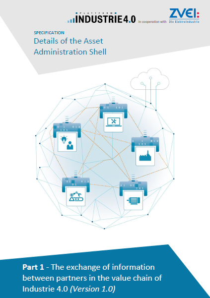

# Welcome!
Welcome to the standard repository of information for the Asset Administration Shell. For more information, see: https://www.plattform-i40.de/I40/Redaktion/EN/Downloads/Publikation/2018-details-of-the-asset-administration-shell.html.

# Tools

For validating the above specification, many users use the Package Explorer as viewer/ editor:
https://git.eclipse.org/r/plugins/gitiles/basyx/basyx/+/master/tools/AasxPackageExplorer/sources

The Basys 4.0 / Basyx project (https://www.basys40.de/) implements various tools and SDK's: 
https://git.eclipse.org/r/plugins/gitiles/basyx/basyx/+/master
